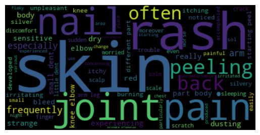
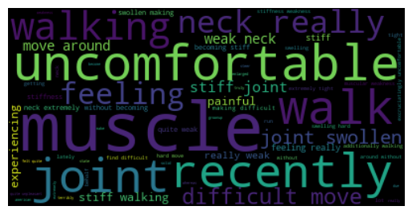

# disease_and_symptoms

## Overview

This project aims to provide text-driven early predictions of disease diagnosis based on symptoms described by patients.

## Business Situation

Process from the first doctor's visit to getting an official diagnosis can be time-consuming and costly for both patients and healthcare providers. One beneficial strategy is initial prediction of diagnosis based on text description of symptoms provided by patients. This prediction can help clinical decision making process become more efficient, and minimize the time and financial costs.

## Data Overview

24 diseases and 50 symptom descriptions from patients are retrieved from [Kaggle](https://www.kaggle.com/datasets/niyarrbarman/symptom2disease). Here, we briefly look at the data file and explore the two columns.

## Methods

Natural Language Processing (NLP) is used to analyze the raw text description of symptoms in the dataset. NLP requires **pre-processing**, which includes steps such as tokenization, cleaning, and lemmatization. Throughout the notebook, specific examples of disease labels, **Psoriasis and Arthritis**, is used for demonstration purposes. Below are word cloud images illustrating frequencies of words in psoriasis and arthritis, respectively.

 **Vectorization** process allows the pre-processed tokens to serve as numerical features in machine learning algorithms. The classification models used are listed below:

 1. Logistic Regression

 2. Multinomial Naive Bayes

 3. Support Vector Machines

 The evaluation metric used is the **accuracy**. In overall, all three models demonstrated high accuracy scores in both train and test sets. However, it is important to keep in mind that the current dataset are limited to only 50 text descriptions of symptoms per disease label, which can influence the performance of these classification models.

 ## Conclusion

Based on the three models established, this project provides some recommendations and future insights:

1. **Acquire symptom descriptions** in text form from patients prior to their initial visits.

2. **Update and expand** the current database with more symptom descriptions from more patients. Also, consider adding more disease labels to the database.

3. **Develop image classification** via computer vision, providing more informative predictions in conjunction to the text-driven diagonsis predictions from this project.

If you have any questions, please contact:

Sangyun (Yun) Thom: [sangyun.thom@gmail.com](mailto:sangyun.thom@gmail.com)

## Repository Structure

├── .gitignore

├── README.md

├── images

├── index.ipynb

├── Symptom2Disease.csv